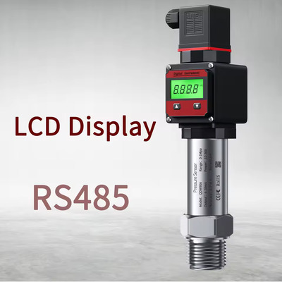

# Pressure Sensors

Choosing the right pressure sensor for your irrigation system is more important than it first seems. I went through three different sensor types before settling on a solution I’m happy with. This page shares that journey so you can hopefully choose the right sensor once, instead of three times.

> If you haven’t yet, also read the [Winterization](README.md#winterization) section to avoid the same corrosion problems I had.

---

## Table of contents

- [5V voltage-output sensor](#5v-voltage-output-sensor)
  - [Limitations of Voltage-Output Sensors](#limitations-of-voltage-output-sensors)
  - [How it works](#how-it-works)
  - [Example ESPHome config](#example-esphome-config)
- [4–20 mA current loop sensor](#4-20-ma-current-loop-sensor)
  - [How it works](#how-it-works-4-20-ma)
  - [Example ESPHome config](#example-esphome-config-1)
- [RS485 (Modbus) pressure sensor](#rs485-modbus-pressure-sensor)
  - [Example ESPHome config](#example-esphome-config-2)
- [Why I stayed with RS485](#why-i-stayed-with-rs485)

---

## 5V voltage-output sensor

**Buy:**  
[**AliExpress**](https://s.click.aliexpress.com/e/_DlGBTMD)


<!-- https://asciiflow.com/#/share/eJyrVspLzE1VslIKKEotLi4tSlUoTs0rzi9S0DAN01TSUcpJrEwtAkpXxyiVpRYVZ%2BbnxShZGenEKFUAaUsLMyCrEiRiaQxklaRWlAA5MUoKBMGjKT2PpjQQQhNiYvKIMasJ7nowD6QLtwUTCLgBSb4pGBIYCnBzQSqm7TI0ClMICA59NGUONgPWQBSZQtU0IZmH6mqIO6fgcOcMhC6IzjBnZxw2NkBsLEpNASlCMh0zpKBmufu5YDNrDdyspJzE5GyQMvxmYXX8DJgCWAgvqUzNyckvV3BxDHHEbRq6AB4b0C3E6T6CqWwCzCYUgDvsnPPzSoryc3JSi6ACxOmdAglVbVDK8fRDGEeMbuTQAcXb9BaIp0nSG2ao4OjiDNOLSF4E9BIM%2FRkYmmKUapVqAQy7u6Q%3D) -->
```
                                  ┌───────────┐
                                  │Pressure   │
 ┌───────┐        ┌──────┐        │Sensor     │
─►12V PSU├──────┬─►5V PSU│        │           │
 └───────┘      │ │   VCC├────────►red VCC    │
                │ │   GND├─────┬──►black GND  │
                │ └──────┘     │┌─┤yellow DATA│
                │              ││ └───────────┘
                │ ┌──────────┐ ││              
                │ │Controller│ ││              
                └─►+12V IN   │ ││              
                  │       GND◄─┘│              
                  │    V1 ADC◄──┘              
                  └──────────┘                 
```

This was my first attempt: a 5V 0–1.2 MPa (0–12 bar) voltage-output pressure sensor. It was cheap, easy to find on AliExpress, and I had seen examples of people using similar parts. In general it is fine for many use cases, and it did work for a full season.

However, at the start of the next season, when I pressurized the system again, it started leaking. I had left the sensor installed over winter, and corrosion had eaten through the sensor body. Lesson learned: for climates with freezing temperatures, you really do need to winterize properly (see [Winterization](README.md#winterization)).

But corrosion wasn’t the only issue.

### Limitations of Voltage-Output Sensors

Voltage-output sensors can be quite sensitive to signal quality:

- Long cable runs, wire resistance, and inductance affect the signal voltage.
- Electrical noise in the environment causes the ADC reading to fluctuate.

As a result, this sensor was not very precise. On top of that:

- Its range (0–1.2 MPa / 0–12 bar) was far above what I actually needed.
- Typical sprinkler systems only need up to about 4 bar, and even with headroom, my pump wouldn’t go above roughly 4.5 bar without flow.

The electronics and firmware side were also more complex:

- Because it was a 5V sensor, I needed a separate 5V PSU.
- [**100 nF Ceramic Capacitor**](https://s.click.aliexpress.com/e/_DDLb1XJ) – [Recommended by Espressif](https://docs.espressif.com/projects/esp-idf/en/v4.4/esp32/api-reference/peripherals/adc.html#minimizing-noise) to minimize the noise in ADC readings.
- In ESPHome, I ended up with three sensors:
  - A **raw voltage sensor** reading the analog value.
  - A **calculated pressure sensor** converting volts to bar.
  - A **moving average sensor** to smooth the readings for stable pressure control.

### How it works

For this sensor I used `0dB` attenuation, which is suitable for inputs in the range `100 mV ~ 950 mV` as per the [ESP32 ADC guidelines](https://docs.espressif.com/projects/esp-idf/en/v4.4/esp32/api-reference/peripherals/adc.html#adc-attenuation). Because the ES32A08 board uses a voltage divider, the measured voltage at the ESP32 side has to be divided by `0.1887` to get the actual sensor voltage. That means 950 mV on the ESP32 corresponds to roughly 5 V on the sensor side.

The sensor itself outputs up to about 4.5 V at 1.2 MPa (12 bar), which is well within that range and, in practice, far above what we ever want to reach. Most sprinklers are rated for up to around 5 bar and drippers for about 3 bar, so the realistic working range for this project is roughly 450 mV on the ESP32 side (about 5 bar).

According to the sensor’s documentation, the relationship between output voltage and pressure is:  
`Vout = VCC * (0.75 * Pressure + 0.1)`  
Rearranging this gives the pressure formula:  
`Pressure = (Vout - 0.1 * VCC) / (0.75 * VCC)`  
This returns the pressure in MPa; multiplying by 10 converts it to bar. At 0 bar, the sensor typically floats between about 0.4 V and 0.54 V.

### Example ESPHome config

This is the original configuration that used the 5V analog sensor with a voltage divider and some filtering. It is kept here as a reference in case you want to replicate or adapt it:

```yaml
sensor:
  # Pressure sensor voltage
  - platform: adc
    id: pressure_v_int
    name: "Pressure Voltage"
    device_class: voltage
    state_class: measurement
    unit_of_measurement: V
    accuracy_decimals: 2
    update_interval: 500ms
    # 0db is rated up to 950mV (ESP32 side), with the ES32A08 board it means up to 5.0V (0.95 * 0.1887)
    attenuation: 0db
    samples: 64
    pin:
      number: GPIO32 # V1 input on the board
      mode:
        input: true
    filters:
      # 0.1887 is the ratio of voltage divider with 43kΩ and 10kΩ resistors in series
      # This is same as `x / 10.0 * (10.0 + 43.0)`
      - lambda: return x / 0.1887;
      # Our update_interval is 0.5s, and we send every 2 updates, i.e. every second
      - sliding_window_moving_average:
          window_size: 3
          send_every: 2
      - round: 3
      # Don't need any higher resolution
      - delta: 0.02

  # Pressure
  - platform: template
    id: pressure
    name: "Pressure"
    device_class: pressure
    state_class: measurement
    unit_of_measurement: bar
    accuracy_decimals: 2
    lambda: !lambda |-
      float pressure_v = id(pressure_v_int).state;
      float psu_v = 5.0;
      if (pressure_v > 0.54) {
        return (pressure_v - 0.1 * psu_v) / (0.75 * psu_v) * 10.0;
      } else {
        return 0.0;
      }
    update_interval: 1s
    filters:
      - round: 2
      - delta: 0.03

  # Smoothed pressure for control logic
  - platform: template
    id: pressure_avg
    name: "Pressure Average"
    internal: true
    device_class: pressure
    state_class: measurement
    unit_of_measurement: bar
    accuracy_decimals: 2
    lambda: !lambda return id(pressure).state;
    update_interval: 1s
    filters:
      - sliding_window_moving_average:
          window_size: 10
          send_every: 5
      - round: 3
      - delta: 0.03
```

---

## 4–20 mA current loop sensor

**Buy:**  
[**AliExpress**](https://s.click.aliexpress.com/e/_c2yOGn0v) (with or w/o LCD screen)


My second attempt was a 4–20 mA current loop pressure sensor. These sensors are very common in industrial setups and have several advantages over voltage-output sensors:

- Current signals are much less susceptible to voltage drop and noise over long cables.
- The reading is more stable and robust, especially in electrically noisy environments.

In my case, this type of sensor was a good match for the existing hardware:

- It could run from 12 V, so there was no need for a separate 5 V PSU.
- It could integrate with the expansion board almost "out of the box".
- Because current loops are less sensitive to interference, the setup didn’t require a ceramic capacitor for ADC noise mitigation.

This was a significant improvement in signal quality and wiring simplicity compared to the 5 V voltage-output sensor.

### How it works (4–20 mA)

> Note: In my case, I have ordered a 0-1 MPa (0-10 bar) sensor. But in reality, the 0-0.6 MPa should be more than enough for most cases and provide higher accuracy, so I will adadpt this example to 6 bar max.

The sensor outputs a current between 4 mA and 20 mA, which gets converted to a voltage by passing through a shunt resistor on a ES32A08 board (91 Ω). At 4 mA the voltage on the resistor is about 0.364 V, and at 20 mA it is about 1.82 V. These two points become the 0-bar and 6-bar endpoints for a simple linear mapping. 

In the template sensor, we read the ADC voltage, subtract the minimum (4 mA) voltage, and scale the result to a 0–10 bar range:

- Values below the minimum voltage are clamped to 0 bar.
- Values above the maximum voltage are clamped to 6 bar.

This gives a straightforward and predictable conversion from current to pressure, while the filters (rounding, debounce/delta) help smooth out noise and reduce jitter in Home Assistant.

### Example ESPHome config

```yaml
  # Pressure sensor voltage
  - platform: adc
    id: pressure_v_int
    pin:
      number: GPIO36
    # ...  everything else is the same as in 5V

  # Pressure
  - platform: template
    id: pressure
    name: "Pressure"
    device_class: pressure
    state_class: measurement
    unit_of_measurement: bar
    accuracy_decimals: 2
    lambda: !lambda |-
      if (isnan(id(pressure_v_int).state)) return NAN;

      float v = id(pressure_v_int).state;
      float min_v = 0.364; // 4mA x 91R
      float max_v = 1.82; // 20mA x 91R

      float bar = (v - min_v) * 6.0 / (max_v - min_v);
      if (bar < 0.0) bar = 0.0;
      if (bar > 6.0) bar = 6.0;
      return bar;
    update_interval: 1s
    filters:
      - round: 2
      - or:
        - debounce: 10s
        - delta: 0.01

  # Smoothed pressure for control logic
  - platform: template
    id: pressure_avg
    # ...  everything else is the same as in 5V
```

---

## RS485 (Modbus) pressure sensor

**Buy:**  
[**AliExpress**](https://s.click.aliexpress.com/e/_c2yOGn0v) (with or w/o LCD screen)



<!-- https://asciiflow.com/#/share/eJyrVspLzE1VslIKKEotLi4tSlUoTs0rzi9S0AgKNrEw1VTSUcpJrEwtAqqojlEqSy0qzszPi1GyMtKJUaoA0paWhkBWJUjE0gzIKkmtKAFyYpQUcINHU3oeTWnAiybExOThNaEJ7l4Qh6DqYIinFOCqcbthAjb9KBygfpDKabsMjcKAjIDg0EdT5oD1riHkL2S0BmSCLtAMBRR3TcGhfAbYHcSEHdiQabuMdN39XJDNRvUREDvn55UU5efkpBbBjJ62y1gXHPG6jth0zYH4WxvkaE8%2FuEFzgGImUH1O2PRNgeiDuQfuANy%2BRXgbPW5hsQG27tH0FmjgIAFMHYRtQY3xGKVapVoAbgNMXg%3D%3D) -->
```
                           ┌──────────┐
                           │Pressure  │
                           │Sensor    │
 ┌───────┐                 │          │
─►12V─PSU├─┬──────────────┬►1-12V     │
 └───────┘ │ ┌──────────┐ └►2-GND     │
           │ │Controller│ ┌►3-RS485-A │
           ├─►+12V IN   │ ├►4-RS485-B │
           └─►GND       │ │└──────────┘
             │     RS485◄─┘            
             └──────────┘              
```

My third and final attempt was an RS485 (Modbus) pressure sensor, which turned out to be the best option for me, even though it is the most expensive (not by much) of the three—especially because I chose a version with an LCD display.

Before this project I had never worked with RS485 or Modbus, and a lot of online explanations go very deep into protocol details that you do not actually need here. For this use case, the setup is quite simple: both the controller and the sensor must share the same GND, and you just connect A to A and B to B. As long as the wiring is correct and the baud rate / address match on both sides, ESPHome takes care of the rest.

One of the nicest advantages of RS485 is that:
- We can determine if the sensor is offline and act on that.
- We don’t have to read and scale analog voltages.
- We simply request the pressure value via Modbus.
- The sensor returns the data directly in KPa (or any other unit by configuring the sensor).

From there, if you want pressure in bar, you just multiply or scale accordingly (for example, KPa → bar). This removes a lot of the complexity compared to the original 5V voltage sensor setup.

By default, many of these sensors come with:
- M20×1.5 thread.
- 24 V power input.

But it’s often possible to message the seller and request custom specs. For my setup, I asked for:
- G1/2" thread.
- 12 V power input.
- And 0.6 MPa (0–6 bar) range.

The difference in build and user experience compared to the original 5 V sensor is huge, this RS485 unit feels like a proper industrial-grade device.

### Example ESPHome config

See detailed example of the setup in [`irrigator-with-pump-2-controllers.yaml`](irrigator-with-pump-2-controllers.yaml).

What to be aware of:
- Disable hardware logging with `logger.baud_rate: 0`.
- `uart`, `modbus`, and `modbus_controller` configurations are the basics that define connection to the modbus device.

---

## Why I stayed with RS485

In the end, I decided to standardize on the RS485 pressure sensor for several reasons:

- Accuracy and stability are excellent.
- Digital communication avoids the usual ADC noise and calibration issues.
- It integrates well once the RS485 wiring is solved.
- It allowed me to expand my RS485 ecosystem and have multiple RS485 devices controlled by the same ESPHome node.

If you’re starting from scratch and are comfortable with a slightly higher upfront cost, I would strongly recommend going straight to an RS485 pressure sensor rather than starting with a cheap 5 V analog unit.
