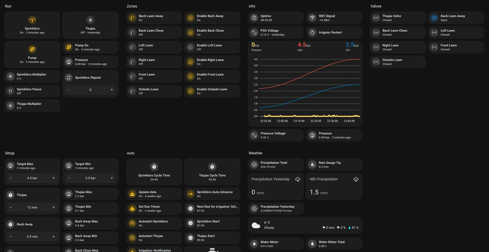
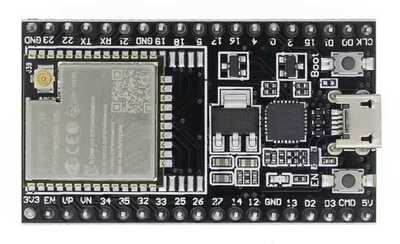
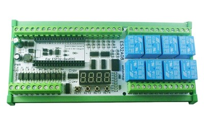
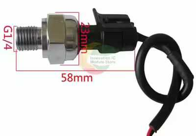

# ESPHome Irrigation System based on ES32A08 Expansion Board




## Key Features

- Up to 8 zones or 7 zones and a pump.
- Automatic irrigation scheduling based on sun elevation.
- Irrigation duration based on actual past precipitation data + forecast. 
- Can also function completely without Home Assistant or even without network.
- Separate "controller" logic for drip irrigation, e.g. garden, thujas, plantations.
- UI switchable logic for everything-automation, without the need to change any code.
- Automatic water pressure control with ability to change the min/max pressure per-zone.

---

[Hardware](#hardware) | [Required Hardware](#required) | [Required Hardware for Pump Control](#required-for-pump-control) | [Optional Hardware](#optional)  
[Connection Diagram](#connection-diagram)  
[How It Works](#how-it-works) | [How Pressure Sensor Works](#pressure-sensor)


## Hardware

### Required

- [**ESP32-WROOM-32E or 32UE**](https://s.click.aliexpress.com/e/_DBjuSlX). It **must** be 38-pin version, and ESP32-WROOM-32UE version is recommended to have an external antenna further away from the high(er) voltage cables.  


- [**ES32A08** Expansion Board](https://s.click.aliexpress.com/e/_DE1CWk5) by _eletechsup_. It is a pretty affordable but very fitting board that has plenty of I/O and most importantly, 8 relays. [More about it in my repo]((https://github.com/makstech/esphome-es32a08-expansion-board-example)) specifically about the use of this board with ESPHome.  


- [**12V Power Supply**](https://s.click.aliexpress.com/e/_DmWa6VJ). This will supply the ES32A08 board. Anything above 1A (10W) is more than sufficient. _Mean Well HDR-15-12_ is a compact option. At this point, I don't remember why, but I bought 60W version.

- **24V AC Transformer**. I've bought an encapsulated 230VAC to 24VAC 30VA (1.25A) transformer. Again, a bit overkill but it handles opening up all 7 valves if I need to dump all the water from the system quickly.

- ... and everything releated to the irrigation itself, like 24VAC valves, rotors, drippers, and so on.

### Required for Pump Control

- [**AC Contactor**](https://s.click.aliexpress.com/e/_DmPWcfj). I don't exactly trust the relays on the board to handle a powerful pump. Make sure that the contactor can handle the power of your pump + some overhead and it's NO (Normally Open). It can be toggled by either 12V PSU, or regular AC. I've got the `2P 16A 2NO 230VAC`, which means that it switches 2 Normally Open circuits (Live and Neutral) using 230VAC.

- [**5V Pressure Sensor**](https://s.click.aliexpress.com/e/_DlGBTMD). This will be used to measure the water pressure in the system to then control the pump. It outputs the voltage based on the pressure and with a simple math formula we can get the pressure.  


- [**Step Down Voltage Module from 12V to 5V**](https://s.click.aliexpress.com/e/_DDEQ7e5). Converting 12V from PSU, to 5V that the pressure sensor accepts.

### Optional

- [**100 nF Ceramic Capacitor**](https://s.click.aliexpress.com/e/_DDLb1XJ). [**Recommended by Espressif**](https://docs.espressif.com/projects/esp-idf/en/v4.4/esp32/api-reference/peripherals/adc.html#minimizing-noise) to minimize the noise in ADC readings.

- [**External Antenna with U.FL/IPEX Pigtail**](https://s.click.aliexpress.com/e/_DEGqnTP). For **32UE** ESP32 variant.

## Disclaimer

I am not responsible for any damage, injury, or consequences that may result from attempting to replicate or modify this project. Working with electricity can be dangerous, and it is important to take proper precautions. If you are not familiar with electrical wiring or unsure about any part of this project, consult a qualified electrician before proceeding. Always follow local electrical codes and safety guidelines.

## Connection Diagram

An extremely simplified ASCII connection diagrams.

### With Pump And up to 7 Zones

I have 1KW pump and I don't trust the puny relays on the board, so I use contactor to actually toggle the pump. 

The contactor is connected to `NO1` output, so in YAML, on the switch `relay_1` we will have a control of the pump.  
The transformer's Neutral is on its own bus bar, and Live output is linked on `COM2` through `COM8`. I just made a simple daisy chained link.  
Valves (zones) then are connected to the `NO2` through `NO8` and Neutral. This means, that we now have control of each zone on `relay_2`, `relay_3` and so on through `relay_8`.

<!-- https://asciiflow.com/#/share/eJylVUFvmzAU%2FiuWr6siEWlr11tCqg1pIZHSceLCOm%2BLRqAy0DaqKkVoxx04WCmHHHPsadop2q%2Fhl8yEODbBBpJaRLHx8%2Fu%2B973H8yP0nBmCl%2FBqMv7ozxAwMJ5%2Bd8Kp74H7afgDjKPZLTyDrjNHmJo92vAO4YBu2%2FCye2bDB%2Fr%2F%2Fl0%2Bm%2BdvLs7pLEQPIV3YEJRGTwefDOsKGCbIyO%2BMLNRPUpyomCVAPmzbk73OSLx3stzovhc6N6GPM7KSgC43eazbIydgxPRHlAEt%2F2QkZfYHZulJeCuZWirqVb9NCZClRIi0UPSfzO5vbaLKPBiLteHdRiEY6v1dJM%2B%2FmDQFXqyPhhrdMEdaqyi3vmMgT3Tds2ZC5pi0XrDvugirMNupmGzZrHiN8UCrDNPaOqotGcpyjFEQRBgVq9epUBdewjGlJsJ%2BPEFe4GO2ErXgAm8VUX2WWtcC48lnRRgvhdHbnU0sIJe1eb0aqrykHLFAtXS9Dma5wehrbiQyI8XONXa84JuPZ4UoFTdJ26IT%2BXwwBzI%2BL3s%2BX1zn5mduxvjUhVtblbJAmlpkyuTb94M5cl3%2FHgx61z3GRzHotlnM8rtlj3Ro09SgBTL1aITLpipG3rYaE5UwbqWhZFDyWGq%2FiVDy0vZ1JE5soijEjiu4BEJy3%2BTfpGFysKN896MA9B1c9i3mLa9XdgUc45lUUlGqzDKOpYHeQGc4i0pX5ThtL0vualHxKYnycCHBjS3HvUMB0DqdzrmkrmUFTfvqaNilBy6a%2Fbf7xCVxHfuszdGOUgOnFuOkC9KGT%2FDpPwop1eY%3D) -->
```
              AC LIVE IN ┌─────────┐      ┌────┐                       
                    │  ┌─►Contactor├──────►Pump│                       
                    │  │ └────────▲┘      └────┘                       
                    │  ├───┐      │                                    
  ┌───────────────┐ │  │ ┌─▼──────┴─┐                                  
┌─┤Input MCB      ◄─┘  │ │COM1   NO1│                                  
│ ├───────────────┤    │ │Controller│                     ┌───────────┐
├─►Pump MCB       ├────┘ └──────────┘                     │Pressure   │
│ ├───────────────┤      ┌───────┐        ┌──────┐        │Sensor     │
├─►Controller MCB ├──────►12V PSU├──────┬─►5V PSU│        │           │
│ ├───────────────┤      └───────┘      │ │   VCC├────────►red VCC    │
└─►Transformer MCB├────┐ ┌───────────┐  │ │   GND├─────┬──►black GND  │
  └───────────────┘    └─►Transformer│  │ └──────┘     │┌─┤yellow DATA│
                         │N      LIVE│  │              ││ └───────────┘
                         └┬────────┬─┘  │ ┌──────────┐ ││              
                      ┌───▼───┐    │    │ │Controller│ ││              
                      │Neutral│    │    └─►+12V IN   │ ││              
                      │Bus Bar│    │      │       GND◄─┘│              
                      └───┬───┘    │      │    V1 ADC◄──┘              
       ┌────────────◄─────┘        │      │          │                 
       │Valves 1...7│              └──────►COM2...8  │                 
       └────────────◄─────────────────────┤NO2...8   │                 
                                          └──────────┘                 
```

## How It Works

The most complete example of the ESPHome YAML can be found in [`irrigator-with-pump-2-controllers.yaml`](irrigator-with-pump-2-controllers.yaml). It has:
- 2 controllers, in my case, sprinkler controller and controller for drip irrigation.
- 1 pump control.
- Automatic water pressure control.

### Pressure sensor

In the yaml, I have 3 sensors in total for pressure. 1st is the pressure sensor voltage; 2nd is the pressure in bar; 3rd is the moving average to smooth out the values for pressure control.

We use `0dB` attenuation, which is [rated](https://docs.espressif.com/projects/esp-idf/en/v4.4/esp32/api-reference/peripherals/adc.html#adc-attenuation) for `100 mV ~ 950 mV`. Considering, that we have to divide the input voltage by `0.1887`, at 950mV that is the equivalent of ~5V. Our pressure sensor ouputs only up to 4.5V, and that's at 1.2MPa (12 bar), which, we hopefully will never reach. Realistically, most sprinklers are rated up to 5 bar, and drippers up to 2 bar. So we are talking about the range of up to 450mV (~5 bar).

The documentation of the pressure sensor states: `Vout = VCC * (0.75 * Pressure + 0.1)`, from this, we can switch around the numbers and get the pressure formula, which is `Pressure = (Vout - 0.1 * VCC) / (0.75 * VCC)`, this would return the pressure in MPa, so we multiply by `10` to get the bar value.  
At 0 bar, the pressure sensor floats around 0.4 - 0.54V.

_This is very simplified yaml, check the [full yaml file](irrigator-with-pump-2-controllers.yaml) with all units, device classes, and so on._
```yaml
  # Pressure sensor voltage
  - platform: adc
    id: pressure_v_int
    name: "Pressure Voltage"
    accuracy_decimals: 2
    update_interval: 500ms
    # 0db is rated up to 950mV (ESP32 side), with the ES32A08 board it means up to 5.0V (0.95 * 0.1887)
    attenuation: 0db
    samples: 64
    pin:
      number: GPIO32 # V1 input on the board
      mode:
        input: true
    filters:
      # 0.1887 is the ratio of voltage divider with 43kΩ and 10kΩ resistors in series
      # This is same as `x / 10.0 * (10.0 + 43.0)`
      - lambda: return x / 0.1887;
      # Our update_interval is 0.5s, and we send every 2 updates, i.e. every second
      - sliding_window_moving_average:
          window_size: 3
          send_every: 2
      - round: 3
      # Don't need any higher resolution
      - delta: 0.02

  # Pressure
  - platform: template
    id: pressure_int
    name: "Pressure"
    accuracy_decimals: 2
    lambda: !lambda |-
      float pressure_v = id(pressure_v_int).state;
      float psu_v = 5.0;
      if (pressure_v > 0.54) {
        return (pressure_v - 0.1 * psu_v) / (0.75 * psu_v) * 10.0;
      } else {
        return 0.0;
      }
    update_interval: 1s
    filters:
      - round: 2
      - delta: 0.03
```

## Home Assistant Automations

> [!NOTE]
> In future, I plan on moving the automation part to ESP32, but for now, it works on the Home Assistant side


## TODOs

- [ ] Intro
- [ ] Rain sensor
- [x] Yaml example
- [ ] Home Assistant automation
- [ ] The math behind irrigation duration
- [x] The math behind pressure sensor
- [ ] Home Assistant dashboard
- [ ] Connection diagrams
- [ ] References
- [ ] The installation process
- [ ] References for pipe sizing, cable sizing
- [ ] Challanges
- [ ] Winterization
- [ ] Move the automation to ESP?
- [ ] Integrate flow meter

## Contributing
Feel free to fork this repository and contribute by submitting pull requests.
